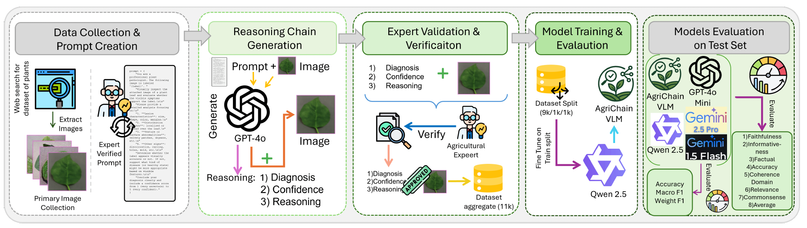
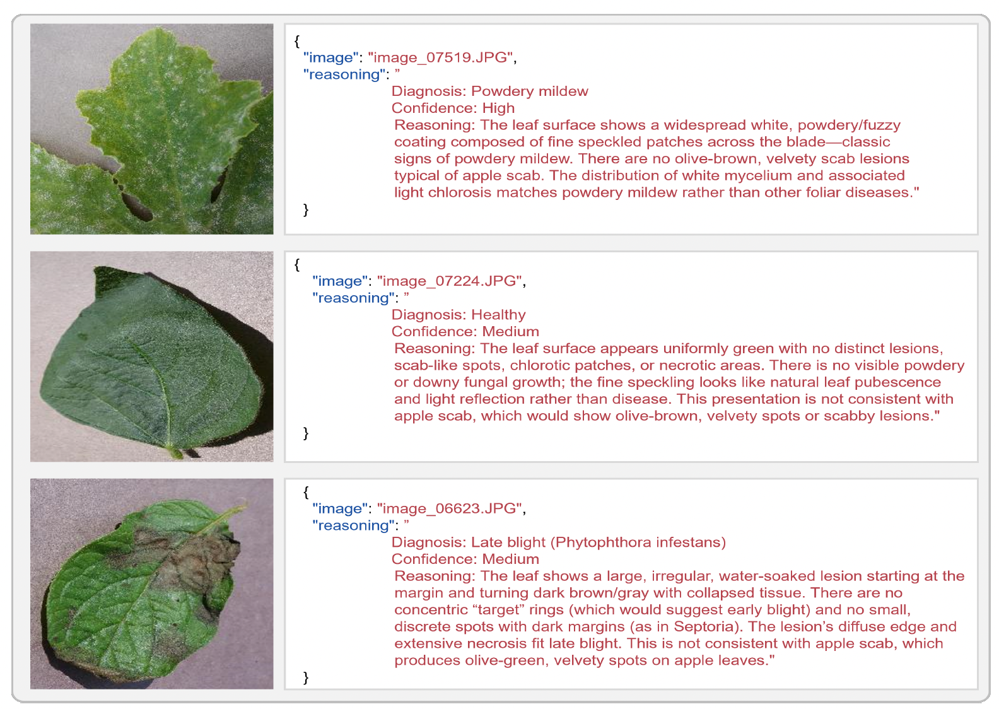
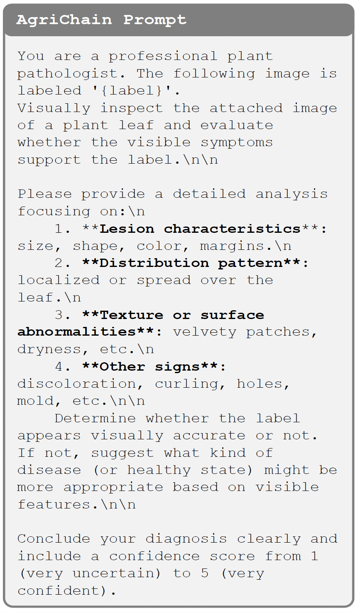
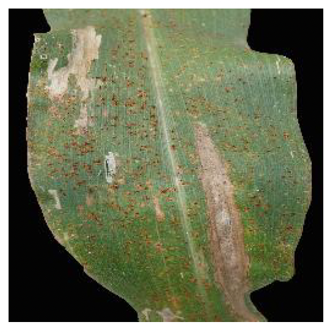

<div style="margin-top:50px;">
  <h1 style="font-size: 30px; margin: 0;">AgriChain: Visually-Grounded Expert-Verified Reasoning for Interpretable Agricultural Vision–Language Models</h1>
</div>

<div align="center" style="margin-top:10px;">

   [Hazza Mahmood ](https://github.com/hazzanabeel12-netizen) &nbsp;
    Yongqiang Yu &nbsp;
   [Rao M. Anwer](https://scholar.google.com/citations?hl=en&user=_KlvMVoAAAAJ) &nbsp;

  Mohamed bin Zayed University of Artificial Intelligence
  <br>
---
  
  [](https://arxiv.org/abs/2604.07814)
 [](agrichain.pdf)
  [](https://github.com/hazzanabeel12-netizen/agrichain)
  [](#dataset-overview)
  <br>
  <br>
</div>

---

## 🌿 Overview

AgriChain is an agricultural vision–language benchmark for interpretable plant disease diagnosis. It pairs plant leaf images with:
- disease labels,
- calibrated confidence levels (`High`, `Medium`, `Low`), and
- expert-verified chain-of-thought rationales grounded in visible symptoms.

The paper introduces AgriChain as a dataset of approximately **11,000 expert-curated leaf images** covering **33 plant-disease classes plus one healthy class**, and fine-tunes **Qwen-2.5-VL-3B** into **AgriChain-VL3B** for visually grounded diagnosis and reasoning.

---

## 🔥 Highlights

- **Expert-Verified Reasoning:** Each sample includes a rationale reviewed and refined by a professional agricultural engineer.
- **Confidence-Aware Diagnosis:** Outputs include calibrated confidence labels alongside the predicted disease.
- **Visually Grounded Explanations:** Rationales explicitly reference lesion color, margin, distribution, texture, and other visible cues.
- **Specialized Agricultural VLM:** Fine-tuning produces **AgriChain-VL3B**, a domain-adapted diagnostic model.
- **Strong Empirical Gains:** On the 1,000-image test set, AgriChain-VL3B achieves **73.1% accuracy**, outperforming strong zero-shot baselines.

<br>

## 🧭 Training Pipeline

<p align="center">
  
</p>

<p align="center">
  <em><b>Figure 1.</b> AgriChain training pipeline. Images from PlantVillage, PlantDoc, and PlantCLEF are aggregated and cleaned to form a unified dataset. GPT-4o drafts image-grounded diagnostic rationales, which are then verified and standardized by an agricultural expert. Finally, Qwen-2.5-VL-3B is fine-tuned on these image+explanation pairs to produce both the disease prediction and an expert-style rationale for each input image.</em>
</p>

---

## 📦 Dataset Overview

After de-duplication, quality filtering, and label harmonization, AgriChain contains approximately:
- **11,000 labeled images**
- **33 disease classes + 1 healthy class**
- **9,000 training / 1,000 validation / 1,000 test images**

The dataset spans a diverse set of crops, including:
- **fruits:** apple, grape, citrus, strawberry
- **vegetables:** tomato, potato, pepper
- **others:** banana and additional plant categories

Each image is paired with a diagnosis-oriented explanation and confidence estimate.

### Sample Structure

| Field | Type | Description |
|---|---|---|
| `image` | `str` | Path or filename of the plant image |
| `crop` | `str` | Crop type |
| `disease_label` | `str` | Ground-truth disease class or healthy label |
| `confidence` | `str` | Expert-assigned confidence level: High / Medium / Low |
| `reasoning` | `str` | Expert-verified diagnostic rationale grounded in visual symptoms |

---

## 🖼️ Example Outputs

<p align="center">
  
</p>

<p align="center">
  <em><b>Figure 2.</b> Example leaf disease classification outputs. Each image is paired with an expert-style diagnosis, confidence level, and reasoning generated by a vision–language model fine-tuned for agricultural disease recognition.</em>
</p>

---

## 📝 Prompting for Reasoning Generation

<p align="center">
  
</p>

<p align="center">
  <em><b>Figure 3.</b> Prompt used in the reasoning-chain generation stage, guiding the model to produce structured diagnostic analyses of plant diseases with expert-level detail and confidence scoring.</em>
</p>

### Prompt Design Principles

The reasoning prompt is designed to mimic the workflow of a professional plant pathologist by asking the model to inspect:
1. **Lesion characteristics** — size, shape, color, and margins
2. **Distribution pattern** — localized or spread over the leaf
3. **Texture / surface abnormalities** — velvety patches, dryness, mold, etc.
4. **Other visual signs** — discoloration, curling, holes, scabbing, and related symptoms

The model then concludes with a diagnosis and a confidence score.

---

## 🧪 Model and Training

We fine-tune **Qwen-2.5-VL-3B** on image–rationale pairs to create **AgriChain-VL3B**, a specialized agricultural vision–language model for diagnosis with reasoning.

### Training Setup

- **Backbone:** Qwen-2.5-VL-3B
- **Optimizer:** AdamW
- **Learning rate:** `2e-5`
- **Batch size:** `16`
- **Scheduler:** cosine decay with `5%` warmup
- **Precision:** FP16
- **Selection:** early stopping based on validation loss

The training objective jointly supervises:
- disease prediction,
- confidence estimation, and
- rationale generation.

---

## 📏 Evaluation

### Diagnostic Metrics
We report:
- **Accuracy**
- **Macro-F1**
- **Weighted-F1**

### Reasoning Quality Criteria
Human evaluators score explanations on six axes:
- **Faithfulness**
- **Informativeness**
- **Factual Accuracy**
- **Coherence**
- **Domain Relevance**
- **Commonsense**

The paper also reports strong inter-annotator agreement:
- **Krippendorff’s α = 0.838**

---

## 🏆 Benchmark Results

### Table 1. Plant-disease diagnosis performance

| Model | Accuracy ↑ | Macro F1 ↑ | Weighted F1 ↑ |
|---|---:|---:|---:|
| Qwen (zero-shot) | 14.4 | 0.023 | 0.149 |
| Gemini 1.5 Flash | 48.7 | 0.105 | 0.430 |
| Gemini 2.5 Pro | 55.8 | 0.141 | 0.476 |
| GPT-4o-mini | 34.9 | 0.053 | 0.318 |
| **AgriChain-VL3B (ours)** | **73.1** | **0.466** | **0.655** |

### Table 2. Human evaluation of reasoning quality

| Model | Faithfulness | Informativeness | Factual Acc. | Coherence | Domain Rel. | Commonsense | Average |
|---|---:|---:|---:|---:|---:|---:|---:|
| Qwen-2.5-VL (base) | 3.5 | 3.2 | 3.4 | 3.3 | 3.0 | 4.0 | 3.40 |
| Gemini 1.5 Flash | 4.3 | 4.2 | 4.4 | 4.3 | 4.5 | 4.5 | 4.37 |
| Gemini 2.5 Pro | 4.5 | 4.4 | 4.6 | 4.5 | 4.7 | 4.6 | 4.55 |
| GPT-4o Mini | 4.5 | 4.3 | 4.6 | 4.4 | 4.6 | 4.7 | 4.52 |
| **AgriChain-VL3B (ours)** | **4.6** | **4.6** | **4.7** | **4.5** | **4.8** | **4.6** | **4.63** |

---

## 🔍 Qualitative Case Study

<p align="center">
  
</p>

<p align="center">
  <em><b>Figure 4.</b> Illustrative diagnostic case. The model predicts <b>Cedar-apple rust</b> with medium confidence and grounds its explanation in visible evidence such as circular orange-to-rust-brown lesions with distinct margins, while explicitly ruling out cues typical of apple scab.</em>
</p>

---

## 🌍 Practical Impact

AgriChain is designed for trustworthy agricultural AI:
- It improves **interpretability**, not just classification accuracy.
- It supports **expert review** through explicit rationales.
- It enables **confidence-aware decision support** for farmers and agronomists.
- It can inform future systems for **field-ready mobile diagnosis** and multilingual agricultural assistance.

---

<br>
<div align="left">

## 💬 Citation

If you use Agrichain in your research, please consider citing:

```bibtex
@misc{mahmood2026agrichainvisuallygroundedexpert,
      title={AgriChain Visually Grounded Expert Verified Reasoning for Interpretable Agricultural Vision Language Models}, 
      author={Hazza Mahmood and Yongqiang Yu and Rao Anwer},
      year={2026},
      eprint={2604.07814},
      archivePrefix={arXiv},
      primaryClass={cs.CV},
      url={https://arxiv.org/abs/2604.07814}, 
}
```

</div>

